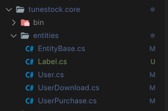
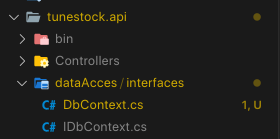
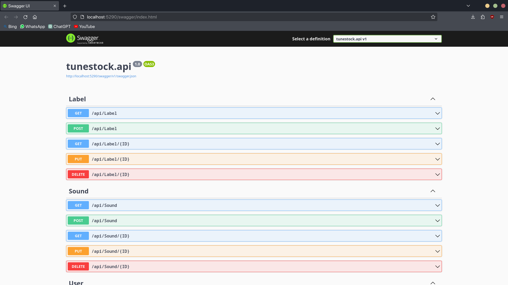
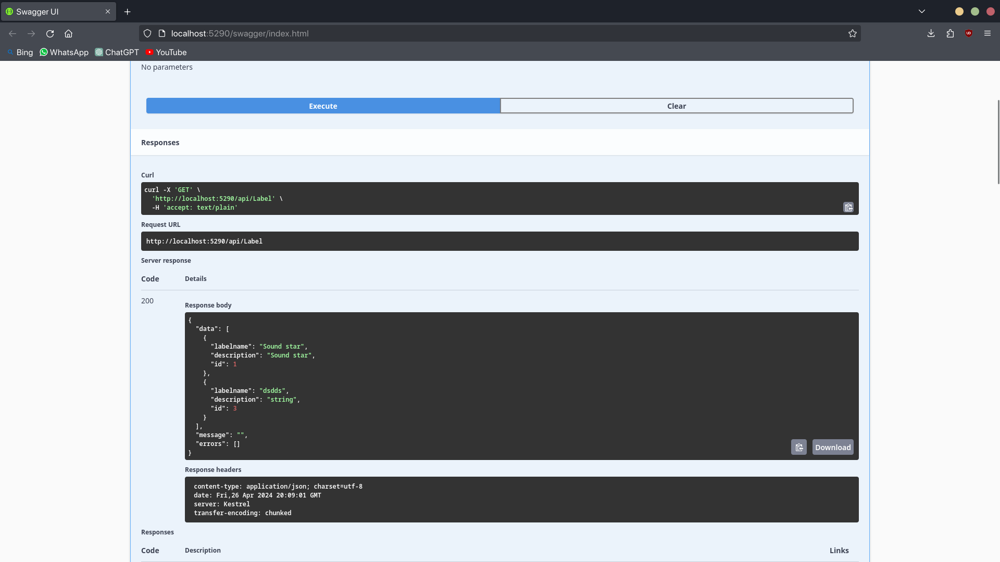
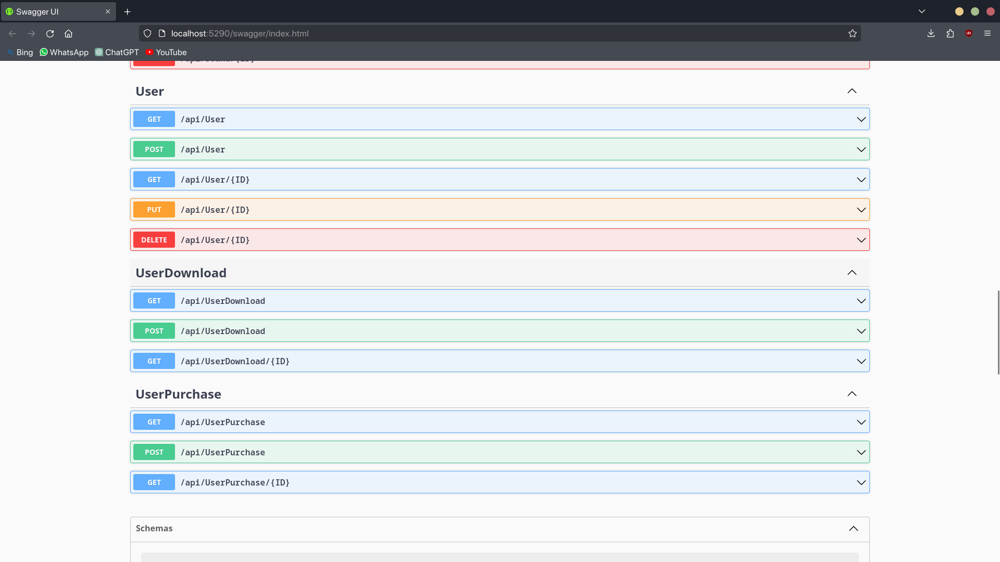
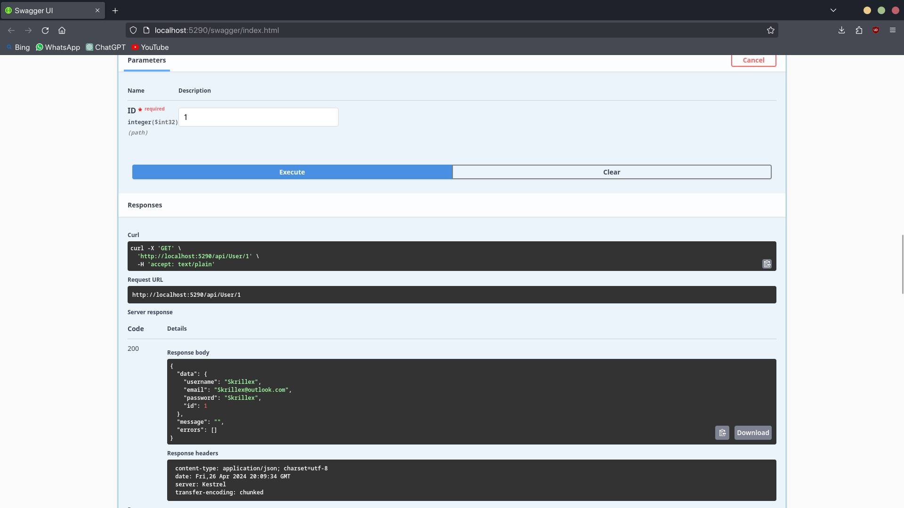

<!---
  <p align="center">
    
  </p>
-->

<style>
  body {
    max-width: 800px;
    margin: 0 auto;
    line-height: 1.5;
  }

  @page {
    size: A4;
    margin: 1cm;
  }

  .no-break {
    page-break-inside: avoid;
  }

  img {
    margin: 10px;
  }
</style>

<center>

#### INSTITUTO TECNOLÓGICO SUPERIOR DE PURÍSIMA DEL RINCÓN
<br>
<br>

<div style="text-align: center;">
  
</div>


##### INGENIERÍA INFORMÁTICA

8VO SEMESTRE
<br>
TECNOLOGÍAS WEB MULTIPLATAFORMA

PROYECTO 2DO PARCIAL DOTNET - TUNESTOCK.
<br>
##### PRESENTA:
TRISTAN FERNANDO SEGURA BARRAGÁN - RS20110001
<br>
<br>
<p style="text-align: right;">SAN FRANCISCO DEL RINCÓN, GTO. 15 DE ABRIL 2024</p>


</center>

<div style="page-break-after: always;"></div>


## Planteamiento de la idea - TuneStuck.

El proyecto pretende ser una plataforma que funja como una **bibliotecta de fragmentos de sonido para producción musical**, de manera que el contenido sea creado por los usuarios y estos mismos puedan decidir si su contenido es gratuito o conlleva un precio descargarlo.

Esto es parte de un modelo de negocio llamado **Modelo de Negocio de Plataforma de Participación**, en el que los usuarios son libres de cargar contenido a la plataforma y decidir si su consumo tiene un precio.

## Plan del proyecto.

### I.- Diseño de la base de datos.

Primeramente, es necesario establecer las funcionalidades de la plataforma y de esta manera determinar el diseño de la base de datos y las clases involucradas en el proyecto.

A continuación se especifican las entidades necesarias:


| Users                                                                                | Sounds                                                                                                       | Purchases                                                                                                                                     | Downloads                                                                                                    | Labels                                                                                          |
| ------------------------------------------------------------------------------------ | ------------------------------------------------------------------------------------------------------------ | --------------------------------------------------------------------------------------------------------------------------------------------- | ------------------------------------------------------------------------------------------------------------ | ----------------------------------------------------------------------------------------------- |
| UserID Username Email Password IsDeleted CreatedBy CreatedDate UpdatedBy UpdatedDate | SoundID UserID    SoundName File      UploadDate IsPremium Price     IsDeleted CreatedBy UpdatedBy UpdatedBy | PurchaseID PurchaseDate SoundPrice   PaymentStatus PaymentMethod UserID       SoundID      CreatedBy    CreatedDate  UpdatedBy    UpdatedDate | DownloadID  SoundID     UserID      DownloadDate IsDeleted   CreatedBy   CreatedDate UpdatedBy   UpdatedDate | LabelID     Label       Description IsDeleted   CreatedBy   CreatedDate UpdatedBy   UpdatedDate |

Por ende, el diagrama de base de datos queda de la siguiente forma:

<p align="center">
    
</p>

#### User.

La tabla *User* se encargará de almacenar toda la información pertinente de un usuario, enlazando la lógica de descargas, sonidos disponibles o comprados, las compras realizadas por el usuario y los sonidos cargados por el usuario en la plataforma.
<br>

#### UserDownloads.

La tabla *UserDownloads* se encargará de almacenar la información sobre cada descarga individual que ha realizado el usuario, es decir, cada sonido que ha descargado el usuario.
<br>

#### UserPurchases.

La tabla *UserPurchases* se encargará de almacenar la información relevante sobre cada compra individual de un sonido que ha realizado el usuario.
<br>

#### Sound.

La tabla *Sound* será la responsable de almacenar la información de cada sonido, como sus etiquetas y la ruta hacia su archivo mp3.
<br>

#### Labels

La tabla *Labels* tendrá la responsabilidad de almacenar la información sobre cada etiqueta asignable a un sonido.
<br>

#### Consideraciones de Lógica

Ahora bien, es importante mencionar que es necesario implementar el uso de **Procedimientos almacenados** o **Triggers**, para de esta forma manejar "tras bambalinas" la información, evitándonos así tener que desarrollar muchas operaciones para la actualización de la información desde el proyecto de **.NET**.
<br>

##### 1.- Compra de un sonido.

Cuando se compre un sonido, será necesario que se haga un *insert* a la tabla de *UserSoundStock*, agregando un sonido al usuario seleccionado. De esta forma podrá ver los sonidos que ha comprado y puede descargar.
<br>

##### 2.- Lógica de eliminación.

Cuando un registro de las siguientes tablas:

- Sound.
- Labels.
- UserDownloads.
- UserPurchases.
- User.

Solamente se asignará un valor **TRUE** a la propiedad de **IsDeleted**, de esta forma manejando solo un *borrado lógico*, que nos permitirá maniobrar con los datos sin tener que efectuar un *borrado físico*, evitando así perdida de datos e incoherencias. En resumen, cuando se elimine un registro solo no será visible por el usuario debido a  la propiedad IsDeleted.

Ahora bien, el usuario podrá restaurar sus datos si así lo desea en algún momento (IsDeleted = FALSE) dependiendo de lo que se pretenda realizar.

##### 3.- Inserción de sonidos y etiquetas.

Debido a la estructura de la base de datos, es necesario establecer un **procedimiento almacenado** que permita insertar un sonido en la tabla Sound y al mismo tiempo, insertar el id de dicho registro y un id de Labels en la tabla SoundsLabels.

### II.- Creación de proyectos y paquetes correspondientes.

Después de haber concluido el diseño de la base de datos, es momento de continuar con la creación de proyectos y paquetes necesarios para desarrollar el proyecto utilizando una arquitectura de capas y el patrón de Modelo-Vista-Controlador (MVC).

El proyecto debe cumplir con la siguiente estructura:

- TuneStock
  - tunestock.database → será la carpeta para almacenar la documentación relacionada con la base de datos.
  - tunestock.docs → será la carpeta para almacenar la documentación del proyecto.
  - tunestock.api → será el proyecto encargado de manejar todas las operaciones backend y ofrecer conexión a la base de datos.
  - tunestock.core → será el proyecto responsable de almacenar el núcleo del programa (aplicación).
  - tunestock.tests → será el proyecto de pruebas unitarias.
  - tunestock.sln → será la solución del proyecto.

Las cuales se crearán de la siguiente manera:

```bash
TuneStock$ dotnet new sln
TuneStock/tunestock.api$ dotnet new webapi
TuneStock/tunestock.core$ dotnet new classlib
TuneStock/tunestock.tests$ dotnet new xunit
```
<br>

Ahora debemos referenciarlos de la siguiente forma:

```bash
TuneStock$ dotnet add tunestock.core/tunestock.core.csproj 
  reference tunestock.api/tunestock.api.csproj 

TuneStock$ dotnet add tunestock.tests/tunestock.tests.csproj 
  reference tunestock.core/tunestock.core.csproj 

TuneStock$ dotnet sln add 
  tunestock.api/tunestock.api.csproj 
  tunestock.core/tunestock.core.csproj 
  tunestock.tests/tunestock.tests.csproj
```
<br>

Después de haber efectuado estos comandos, la referencia entre proyectos debería quedar de la siguiente forma:

- tunestock.api hace uso de tunestock.core.
- tunestock.tests hace uso de tunestock.core.
- TuneStock.sln hace uso de tunestock.api, tunestock.core y tunestock.tests.

Ahora simplemente podemos realizar el siguiente comando para compilar la solución y observar que todo ha sido construido correctamente

```bash
TuneStock$ dotnet build
```
<br>

### III.- Desarrollo del proyecto Core.

Primeramente, hay que instalar los paquetes NuGet necesarios para el desarrollo de este proyecto, los cuales son **Dapper**, **Dapper.contrib** y **MySqlConnector**, donde Dapper es un micro-ORM que nos permitirá mapear nuestra base de datos dentro de dotnet, Dapper.contrib agrega funcionalidades asíncronas a nuestra instalación de Dapper y MySqlConnector para crear la conexión a nuestra base de datos, de esta manera manejaremos de mejor forma las operaciones que requieran conexión con la base de datos, podremos hacerlo de la siguiente manera:

```bash
TuneStock/tunestock.api$ dotnet add package Dapper
TuneStock/tunestock.api$ dotnet add package Dapper.Contrib
```

Ahora dentro proyecto Core, manejaremos todas las clases que podrán ser utilizadas en nuestro programa.

#### 1.- Tunestock.core.entities.

Aquí se encontrarán todas las entidades u objetos que serán participes en nuestro proyecto, las cuales, debido a la lógica de la base de datos son las siguientes:

<p align="center">
    
</p>

##### ¿Por qué no incluimos dos tablas?

Las tablas de la base de datos llamadas *UserSoundStock* y *SoundsLabels* no serán incluidas en el paquete de entities porque no cumplen las cualidades necesarias para ser una entidad completa, es decir, que solo son tablas para mantener una relación, por lo tanto no son indispensables para el programa, pues su uso puede ser a través de un trigger para *UserSoundStock* y un stored procedure para *SoundsLabels*.

##### 1.- EntityBase.cs

```Csharp
//Nombre del paquete al que pertenece esta clase
namespace tunestock.core.entities;

public abstract class EntityBase{

    /*Esta clase permitirá construir objetos con esta clase "base"
    que nos proporciona los siguientes atributos base*/

    public int ID { get; set; }

    public bool IsDeleted { get; set; }

    public string? CreatedBy { get; set; }

    public DateTime CreatedDate { get; set; }

    public string? UpdatedBy { get; set; }

    public DateTime UpdatedDate { get; set; }

}
```

##### 2.- Label.cs:

```Csharp
//Importamos el decorador para establecer la tabla SQL objetivo
using System.ComponentModel.DataAnnotations.Schema;

//Nombre del paquete al que pertenece la clase
namespace tunestock.core.entities;

[Table("Labels")] //Apuntamos a la tabla objetivo en la base de datos
public class Label : EntityBase {

    public string? Labelname { get; set; }

    public string? Description { get; set; }

}
```

##### 3.- User.cs:

```Csharp
//Importamos el decorador para establecer la tabla SQL objetivo
using System.ComponentModel.DataAnnotations.Schema;

//Nombre del paquete al que pertenece la clase
namespace tunestock.core.entities;


[Table("User")] //Apuntamos a la tabla correspondiente
public class User : EntityBase {
    /*Heredamos los atributos base*/

    public string? Username { get; set; }

    public string? Email { get; set; }

    public string? Password { get; set; }

}
```

##### 4.- UserDownload.cs:

```Csharp
//Importamos el decorador para establecer la tabla SQL objetivo
using System.ComponentModel.DataAnnotations.Schema;

//Nombre del paquete al que pertenece la clase
namespace tunestock.core.entities;

[Table("UserDownloads")] //Apuntamos a la tabla correspondiente
public class UserDownload {
    
    public int ID { get; set; }

    public int SoundID_FK { get; set; }
    
    public int UserID_FK { get; set; }

    public DateTime DownloadedDate { get; set; }

}
```

##### 5.- UserPurchase.cs:

```Csharp
//Importamos el decorador para establecer la tabla SQL objetivo
using System.ComponentModel.DataAnnotations.Schema;

//Nombre del paquete al que pertenece la clase
namespace tunestock.core.entities;

[Table("UserPurchases")] //Apuntamos a la tabla correspondiente
public class UserPurchase : EntityBase {

    public DateTime PurchasedDate { get; set; }

    public double SoundPrice { get; set; }

    public bool PaymentStatus { get; set; }

    public string? PaymentMethod { get; set; }

    public int UserID_FK { get; set; }

    public int SoundID_FK { get; set; }

}
```
<br>

#### 2.- Tunestock.api.dataAccess.

En este momento ya tenemos nuestras entidades creadas, por lo tanto podemos proceder a la conexión con la base de datos de la siguiente forma.

<p align="center">
    
</p>

##### IDbContext.cs

```Csharp
//Importamos el paquete que nos permita usar DbConnection
using System.Data.Common;

//Nombre del paquete al que pertenece la clase
namespace tunestock.api.dataAccess.interfaces;

public interface IDbContext{
    //Nos devolverá la conexión a la base de datos
    DbConnection Connection { get; }

}
```

##### DbContext.cs

Hay que aclarar que para esta clase, es necesario utilizar credenciales de acceso a la base de datos, por lo tanto las almacenaremos en appsettings.json de la siguiente manera:

```json
{
  "Logging": {
    "LogLevel": {
      "Default": "Information",
      "Microsoft.AspNetCore": "Warning"
    }
  },
  "ConnectionStrings": {
    "DefaultConnection" : "Server=localhost;
      Database=TuneStock;
        Uid=starboy;
          Pwd=starboyc00l;"
  },
  "AllowedHosts": "*"
}
```

```Csharp
//Importamos el paquete que nos permita manejar Connections
using System.Data.Common;
//Importamos el paquete que contiene nuestra interfaz
using tunestock.api.dataAccess.interfaces;
//Importamos el conector de MySQL que instalamos previamente
using MySqlConnector;

public class DbContext : IDbContext{

    private readonly IConfiguration _config;
    public DbContext(IConfiguration config){
        _config = config;
    }
    
    //Esta será nuestra variable de conexión
    private MySqlConnection _connection; 

    //Devolverá la conexión a la base de datos
    public DbConnection Connection{
        get{
            if(_connection == null){
                //DefaultConnection está definido en appsettgins.json
                _connection = new MySqlConnection(
                    _config.GetConnectionString("DefaultConnection"));
            }
            return _connection;
        }
    }
}
```

#### 3.- Tunestock.api.dto.

Se plantea el uso de Data-Transfer-Objects para el manejo de los objetos dentro del programa, de esta manera evitando que el usuario visualicé todos los atributos de los objetos cuando estos sean consumidos por la aplicación de .NET. Se describen a continuación:

##### 1.- DtoBase.cs

```Csharp
//Nombre del paquete al pertenece la clase
namespace tunestock.api.dto;

//Es una clase abstracta para poder ser implementada en otra clase
public abstract class DtoBase{
    
    public int ID { get; set; }

}
```

##### 2.- LabelDto.cs

```Csharp
//Importamos la entidad correspondiente
using tunestock.core.entities;

//Nombre del paquete al que pertenece la clase
namespace tunestock.api.dto;

public class LabelDto : DtoBase{
    
    public string? Labelname { get; set; }
    public string? Description {get; set;}

    public LabelDto(){
        
    }

    public LabelDto(Label label){
        ID = label.ID;
        Labelname = label.Labelname;
        Description = label.Description;
    }

}
```

##### 3.- UserDto.cs

```Csharp
//Importamos la entidad correspondiente
using tunestock.core.entities;

namespace tunestock.api.dto;

public class UserDto: DtoBase{

    public string? Username { get; set; }
    public string? Email { get; set; }
    public string? Password {get; set; }

    public UserDto(){

    }

    public UserDto(User user){
        ID = user.ID;
        Username = user.Username;
        Email = user.Email;
        Password = user.Password;
    }

}
```

##### 4.- UserPurchaseDato.cs

```Csharp
//Importamos la entidad correspondiente
using tunestock.core.entities;

//Nombre del paquete al que pertenece la clase
namespace tunestock.api.dto;

public class UserPurchaseDto : DtoBase{

    public DateTime PurchasedDate { get; set; }

    public double SoundPrice { get; set; }

    public bool PaymentStatus { get; set; }

    public string? PaymentMethod { get; set; }

    public int UserID_FK { get; set; }

    public int SoundID_FK { get; set; }

    public UserPurchaseDto(){

    }

    public UserPurchaseDto(UserPurchase userPurchase){
        ID = userPurchase.ID;
        PurchasedDate = userPurchase.PurchasedDate;
        SoundPrice = userPurchase.SoundPrice;
        PaymentStatus = userPurchase.PaymentStatus;
        PaymentMethod = userPurchase.PaymentMethod;
        UserID_FK = userPurchase.UserID_FK;
        SoundID_FK = userPurchase.SoundID_FK;
    }

}
```

##### InputDto.

Dentro de la mis carpeta de dto, será necesario crear un InputDto para cada Dto, cada InputDto es prácticamente igual a su Dto, solamente no contiene el ID, puesto los objetos InputDto será utilizados para recibir los datos que el usuario no debe ingresar, el cual sería el ID en esta ocasión. Es por ello que no serán descritos, pues solo se omite el ID.

### 4.- Tunestock.api.repositories.

Es momento de describir los repositorios del programa, los cuales funcionarán como su nombre lo dice, repositorios de información local, de esta forma nos evitaremos estar accediendo directamente a la información de la base de datos a través de la aplicación principal de dotNET.

#### 1.- LabelRepository.cs

```Csharp
//Importamos las entidades, interfaces y el dataaccess
using tunestock.core.entities;
using tunestock.api.repositories.interfaces;
using tunestock.api.dataAccess.interfaces;

//Importamos dapper y dapper.contrib
using Dapper;
using Dapper.Contrib.Extensions;
using System.ComponentModel;

//Nombre del paquete al que pertenecen
namespace tunestock.api.repositories;

public class LabelRepository : ILabelRepository{

    private readonly IDbContext _dbContext;

    public LabelRepository(IDbContext context){
        _dbContext = context;
    }

    public async Task<bool> DeleteAsync(int ID){
        
        try{
            var label = await GetByID(ID);

            if(label == null){
                return false;
            }

            label.IsDeleted = true;
            Console.WriteLine("ELIMINADO CORRECTAMENTE - LabelRepository (DeleteAsync)");
            return await _dbContext.Connection.UpdateAsync(label);

        }catch(Exception ex){
            Console.WriteLine("HA OCURRIDO UN ERROR - LabelRepository (DeleteAsync): " + ex.StackTrace);
            return false;
        }

    }

    public async Task<List<Label>> GetAllAsync(){
        
        try{
            const string query = "SELECT * FROM Labels WHERE IsDeleted = 0";
            var labels = await _dbContext.Connection.QueryAsync<Label>(query);
            Console.WriteLine("OBTENIDOS CON EXITO - LabelRepository (GetAllAsync)");
            return labels.ToList();

        }catch(Exception ex){
            Console.WriteLine("HA OCURRIDO UN ERROR - LabelRepository (GetAllAsync)" + ex.StackTrace);
            return null;
        }

    }

    public async Task<Label> GetByID(int LabelID){
        try{
            var label = await _dbContext.Connection.GetAsync<Label>(LabelID);

            if(label == null){
                return null;
            }

            Console.WriteLine("OBTENIDO CON EXITO - LabelRepository (GetByID)");

            return label.IsDeleted == true ? null: label;

        }catch(Exception ex){
            Console.WriteLine("HA OCURRIDO UN ERROR - LabelRepository (GetByID)" + ex.StackTrace);
            return null;
        }
    }

    public async Task<Label> SaveAsync(Label label){
        try{
            label.ID = await _dbContext.Connection.InsertAsync(label);
            Console.WriteLine("GUARDADO CORRECTAMENTE - LabelRepository (SaveAsync)");
            return label;

        }catch(Exception ex){
            Console.WriteLine("HA OCURRIDO UN ERROR - LabelRepository (SaveAsync): " + ex.StackTrace);
            return null;
        }
    }

    public async Task<Label> UpdateAsync(Label label)
    {
        try{
            await _dbContext.Connection.UpdateAsync(label);
            Console.WriteLine("ACTUALIZADO CORRECTAMENTE - LabelRepository (UpdateAsync)");
            return label;
            
        }catch(Exception ex){
            Console.WriteLine("HA OCURRIDO UN ERROR - LabelRepository (UpdateAsync): " + ex.StackTrace);
            return null;
        }
    }

}
```

#### 2.- SoundRepository.cs

```Csharp
//Importamos las entidades, interfaces y el dataaccess
using tunestock.core.entities;
using tunestock.api.repositories.interfaces;
using tunestock.api.dataAccess.interfaces;

//Importamos dapper y dapper.contrib
using Dapper;
using Dapper.Contrib.Extensions;
using System.ComponentModel;
using System.Data;

//Nombre del paquete al que pertenecen
namespace tunestock.api.repositories;

public class SoundRepository : ISoundRepository{

    private readonly IDbContext _dbContext;

    public SoundRepository(IDbContext context){
        _dbContext = context;
    }

    public async Task<bool> DeleteAsync(int ID){
        
        try{
            var sound = await GetByID(ID);

            if(sound == null){
                return false;
            }

            sound.IsDeleted = true;
            Console.WriteLine("ELIMINADO CORRECTAMENTE - SoundRepository (DeleteAsync)");
            return await _dbContext.Connection.UpdateAsync(sound);

        }catch(Exception ex){
            Console.WriteLine("HA OCURRIDO UN ERROR - SoundRepository (DeleteAsync): " + ex.StackTrace);
            return false;
        }

    }

    public async Task<List<Sound>> GetAllAsync(){
        
        try{
            const string query = "SELECT * FROM Sound WHERE IsDeleted = 0";
            var sounds = await _dbContext.Connection.QueryAsync<Sound>(query);
            Console.WriteLine("OBTENIDOS CON EXITO - SoundRepository (GetAllAsync)");
            return sounds.ToList();

        }catch(Exception ex){
            Console.WriteLine("HA OCURRIDO UN ERROR - SoundRepository (GetAllAsync)" + ex.StackTrace);
            return null;
        }

    }

    public async Task<Sound> GetByID(int SoundID){
        try{
            var sound = await _dbContext.Connection.GetAsync<Sound>(SoundID);

            if(sound == null){
                return null;
            }

            Console.WriteLine("OBTENIDO CON EXITO - SoundRepository (GetByID)");

            return sound.IsDeleted == true ? null: sound;

        }catch(Exception ex){
            Console.WriteLine("HA OCURRIDO UN ERROR - SoundRepository (GetByID)" + ex.StackTrace);
            return null;
        }
    }

    public async Task<Sound> SaveAsync(Sound sound, int labelId){
        try{
            // Ejecutar el procedimiento almacenado
        var parameters = new {
            p_UserID = sound.UserID,
            p_SoundName = sound.SoundName,
            p_File = sound.File,
            p_IsPremiun = sound.IsPremiun,
            p_Price = sound.Price,
            p_IsDeleted = sound.IsDeleted,
            p_CreatedBy = sound.CreatedBy,
            p_CreatedDate = sound.CreatedDate,
            p_UpdatedBy = sound.UpdatedBy,
            p_UpdatedDate = sound.UpdatedDate,
            p_LabelID = labelId // Pasar el ID de la etiqueta como parámetro
        };

        await _dbContext.Connection.ExecuteAsync("InsertSoundAndLabel", parameters, commandType: CommandType.StoredProcedure);

        // Obtener el nuevo ID del sonido insertado
        var newSoundId = await _dbContext.Connection.ExecuteScalarAsync<int>("SELECT LAST_INSERT_ID()");

        // Asignar el nuevo ID al objeto sound
        sound.ID = newSoundId;

        // Devolver el sonido recién insertado
        return sound;

        }catch(Exception ex){
            Console.WriteLine("HA OCURRIDO UN ERROR - SoundRepository (SaveAsync) xd: " + ex.StackTrace);
            return null;
        }
    }

    public async Task<Sound> UpdateAsync(Sound sound)
    {
        try{
            await _dbContext.Connection.UpdateAsync(sound);
            Console.WriteLine("ACTUALIZADO CORRECTAMENTE - SoundRepository (UpdateAsync)");
            return sound;
            
        }catch(Exception ex){
            Console.WriteLine("HA OCURRIDO UN ERROR - SoundRepository (UpdateAsync): " + ex.StackTrace);
            return null;
        }
    }

}
```

#### 3.- UserDownloadRepository.cs

```Csharp
//Importamos las entidades, interfaces y el dataaccess
using tunestock.core.entities;
using tunestock.api.repositories.interfaces;
using tunestock.api.dataAccess.interfaces;

//Importamos dapper y dapper.contrib
using Dapper;
using Dapper.Contrib.Extensions;
using System.ComponentModel;

//Nombre del paquete al que pertenecen
namespace tunestock.api.repositories;

public class UserDownloadRepository : IUserDownloadRepository{
    private readonly IDbContext _dbContext;

    public UserDownloadRepository(IDbContext context){
        _dbContext = context;
    }

    public async Task<List<UserDownload>> GetAllAsync(int userID_FK){
        
        try{
            string query = $"SELECT * FROM UserDownloads WHERE UserID_FK = {userID_FK};";
            var userDownloads = await _dbContext.Connection.QueryAsync<UserDownload>(query);
            Console.WriteLine("OBTENIDOS CON EXITO - UserDownloadRepository (GetAllAsync)");
            return userDownloads.ToList();

        }catch(Exception ex){
            Console.WriteLine("HA OCURRIDO UN ERROR - UserDownloadRepository (GetAllAsync)" + ex.StackTrace);
            return null;
        }

    }

    public async Task<UserDownload> GetByID(int ID){
        try{
            var userDownload = await _dbContext.Connection.GetAsync<UserDownload>(ID);

            if(userDownload == null){
                return null;
            }

            Console.WriteLine("OBTENIDO CON EXITO - UserDownloadRepository (GetByID)");

            return userDownload;

        }catch(Exception ex){
            Console.WriteLine("HA OCURRIDO UN ERROR - UserDownloadRepository (GetByID)" + ex.StackTrace);
            return null;
        }
    }

    public async Task<UserDownload> SaveAsync(UserDownload userDownload){
        try{
            userDownload.ID = await _dbContext.Connection.InsertAsync(userDownload);
            Console.WriteLine("GUARDADO CORRECTAMENTE - UserDownloadRepository (SaveAsync)");
            return userDownload;

        }catch(Exception ex){
            Console.WriteLine("HA OCURRIDO UN ERROR - UserDownloadRepository (SaveAsync): " + ex.StackTrace);
            return null;
        }
    }

    public async Task<List<UserDownload>> IfExistsByUserID_FK(int userID_FK){
        
        try{
            string query = $"SELECT * FROM UserDownloads WHERE UserID_FK = {userID_FK};";
            var userDownloads = await _dbContext.Connection.QueryAsync<UserDownload>(query);
            Console.WriteLine("UserID_FK → "+userDownloads.AsList()[0].SoundID_FK);
            Console.WriteLine("OBTENIDOS CON EXITO - UserDownloadRepository (IfExistsByUserID_FK)");
            return userDownloads.ToList();

        }catch(Exception ex){
            Console.WriteLine("HA OCURRIDO UN ERROR - UserDownloadRepository (IfExistsByUserID_FK)" + ex.StackTrace);
            return null;
        }

    }

}
```

#### 4.- UserPurchaseRepository.cs

```Csharp
//Importamos las entidades, interfaces y el dataaccess
using tunestock.core.entities;
using tunestock.api.repositories.interfaces;
using tunestock.api.dataAccess.interfaces;

//Importamos dapper y dapper.contrib
using Dapper;
using Dapper.Contrib.Extensions;
using System.ComponentModel;

//Nombre del paquete al que pertenecen
namespace tunestock.api.repositories;

public class UserPurchaseRepository : IUserPurchaseRepository{

    private readonly IDbContext _dbContext;

    public UserPurchaseRepository(IDbContext context){
        _dbContext = context;
    }

    public async Task<List<UserPurchase>> GetAllAsync(int userID_FK){
        try{
            string query = $"SELECT * FROM UserPurchases WHERE UserID_FK = {userID_FK};";
            var userPurchase = await _dbContext.Connection.QueryAsync<UserPurchase>(query);
            Console.WriteLine("OBTENIDOS CON EXITO - UserPurchaseRepository (GetAllAsync)");
            return userPurchase.ToList();

        }catch(Exception ex){
            Console.WriteLine("HA OCURRIDO UN ERROR - UserPurchaseRepository (GetAllAsync): " + ex.StackTrace);
            return null;
        }
    }

    public async Task<UserPurchase> GetByID(int ID){
        try{
            var userPurchase = await _dbContext.Connection.GetAsync<UserPurchase>(ID);

            if(userPurchase == null){
                return null;
            }

            Console.WriteLine("OBTENIDO CON EXITO - UserPurchaseRepository (GetByID)");

            return userPurchase.IsDeleted == true ? null: userPurchase;

        }catch(Exception ex){
            Console.WriteLine("HA OCURRIDO UN ERROR - UserPurchaseRepository (GetByID): " + ex.StackTrace);
            return null;
        }
    }

    public async Task<UserPurchase> SaveAsync(UserPurchase userPurchase){
        try{
            userPurchase.ID = await _dbContext.Connection.InsertAsync(userPurchase);
            Console.WriteLine("GUARDADO CORRECTAMENTE - UserPurchaseRepository (SaveAsync)");
            return userPurchase;

        }catch(Exception ex){
            Console.WriteLine("HA OCURRIDO UN ERROR - UserPurchaseRepository (SaveAsync): " + ex.StackTrace);
            return null;
        }
    }

    public async Task<List<UserPurchase>> IfExistsByUserID_FK(int userID_FK)
    {
        try{
            string query = $"SELECT * FROM UserPurchases WHERE UserID_FK = {userID_FK};";
            var userPurchase = await _dbContext.Connection.QueryAsync<UserPurchase>(query);
            Console.WriteLine("UserID_FK → "+userPurchase.AsList()[0].SoundID_FK);
            Console.WriteLine("OBTENIDOS CON EXITO - UserPurchaseRepository (IfExistsByUserID_FK)");
            return userPurchase.ToList();

        }catch(Exception ex){
            Console.WriteLine("HA OCURRIDO UN ERROR - UserPurchaseRepository (GetByID): " + ex.StackTrace);
            return null;
        }
    }

}
```

#### 5.- UserRepository.cs

```Csharp
//Importamos las entidades, interfaces y el dataaccess
using tunestock.core.entities;
using tunestock.api.repositories.interfaces;
using tunestock.api.dataAccess.interfaces;

//Importamos dapper y dapper.contrib
using Dapper;
using Dapper.Contrib.Extensions;
using System.ComponentModel;

//Nombre del paquete al que pertenecen
namespace tunestock.api.repositories;

public class UserRepository : IUserRepository {

    private readonly IDbContext _dbContext;

    public UserRepository(IDbContext context){
        _dbContext = context;
    }

    public async Task<bool> DeleteAsync(int ID){
        try{
            var user = await GetByID(ID);

            if(user == null){
                return false;
            }

            user.IsDeleted = true;
            Console.WriteLine("ELIMINADO CORRECTAMENTE - userRepository (DeleteAsync)");
            return await _dbContext.Connection.UpdateAsync(user);

        }catch(Exception ex){
            Console.WriteLine("HA OCURRIDO UN ERROR - UserRepository (DeleteAsync)" + ex.StackTrace);
            return false;
        }
    }

    public async Task<List<User>> GetAllAsync(){
        try{
            const string query = "SELECT * FROM User WHERE IsDeleted = 0";
            var users = await _dbContext.Connection.QueryAsync<User>(query);
            Console.WriteLine("OBTENIDOS CON EXITO - userRepository (GetAllAsync)");
            return users.ToList();

        }catch(Exception ex){
            Console.WriteLine("HA OCURRIDO UN ERROR - UserRepository (GetAllAsync)" + ex.StackTrace);
            return null;
        }
    }

    public async Task<User> GetByID(int ID){
        try{
            var user = await _dbContext.Connection.GetAsync<User>(ID);

            if(user == null){
                return null;
            }

            Console.WriteLine("OBTENIDO CON EXITO - userRepository (GetByID)");

            return user.IsDeleted == true ? null: user;

        }catch(Exception ex){
            Console.WriteLine("HA OCURRIDO UN ERROR - UserRepository (GetByID)" + ex.StackTrace);
            return null;
        }
    }

    public async Task<User> SaveAsync(User user){
        try{
            user.ID = await _dbContext.Connection.InsertAsync(user);
            Console.WriteLine("GUARDADO CORRECTAMENTE - userRepository (SaveAsync)");
            return user;

        }catch(Exception ex){
            Console.WriteLine("HA OCURRIDO UN ERROR - UserRepository (SaveAsync)" + ex.StackTrace);
            return null;
        }
    }

    public async Task<User> UpdateAsync(User user){
        try{
            await _dbContext.Connection.UpdateAsync(user);
            Console.WriteLine("ACTUALIZADO CORRECTAMENTE - userRepository (UpdateAsync)");
            return user;

        }catch(Exception ex){
            Console.WriteLine("HA OCURRIDO UN ERROR - UserRepository (UpdateAsync)" + ex.StackTrace);
            return null;
        }
    }
}
```


### 5.- Tunestock.api.services.

En este paquete, se almacenan los servicios que interactuarán con nuestros repositorios que harán las solicitudes necesarias a la base de datos. Se empleó esta forma para reducir el grado de responsabilidad que tiene cada controlador.

#### 1.- LabelService.cs

```Csharp
//Imports de los paquetes correspondientes
using tunestock.api.dto;
using tunestock.api.repositories.interfaces;
using tunestock.api.services.interfaces;
using tunestock.core.entities;

//Nombre del paquete al que pertenece la clase
namespace tunestock.api.services;

public class LabelService : ILabelService{

    private readonly ILabelRepository _labelRepository;

    public LabelService(ILabelRepository labelRepository){
        _labelRepository = labelRepository;
    }


    public async Task<bool> DeleteAsync(int ID){
        try{
            return await _labelRepository.DeleteAsync(ID);
        }catch(Exception ex){
            Console.WriteLine("HA OCURRIDO UN ERROR - LabelService (DeleteAsync):" + ex.StackTrace);
            return false;
        }
    }

    public async Task<List<LabelDto>> GetAllAsync(){
        try{
            var labels = await _labelRepository.GetAllAsync();
            var labelsDto = labels.Select(l => new LabelDto(l)).ToList();
            return labelsDto;
        }catch(Exception ex){
            Console.WriteLine("HA OCURRIDO UN ERROR - LabelService (GetAllAsync):" + ex.StackTrace);
            return null;
        }
    }

    public async Task<LabelDto> GetByID(int ID){
        try{
            var label = await _labelRepository.GetByID(ID);
            if(label == null){
                throw new Exception("Label not found");
            }

            var labelDto = new LabelDto(label);
            return labelDto;
        
        }catch(Exception ex){
            Console.WriteLine("HA OCURRIDO UN ERROR - LabelService (GetByID):" + ex.StackTrace);
            return null;
        }
    }

    public async Task<bool> LabelExists(int ID)
    {
        try{
            var label = await _labelRepository.GetByID(ID);
            return (label != null);

        }catch(Exception ex){
            Console.WriteLine("HA OCURRIDO UN ERROR - LabelService (LabelExists):" + ex.StackTrace);
            return false;
        }
    }

    public async Task<LabelDto> SaveAsync(LabelDto labelDto){
        try{
            var label = new Label{
                Labelname = labelDto.Labelname,
                Description = labelDto.Description,
                CreatedBy = "Starryboy",
                CreatedDate = DateTime.Now,
                UpdatedBy = "Starryboy",
                UpdatedDate = DateTime.Now
            };

            label = await _labelRepository.SaveAsync(label);
            labelDto.ID = label.ID;

            return labelDto;

        }catch(Exception ex){
            Console.WriteLine("HA OCURRIDO UN ERROR - LabelService (SaveAsync):" + ex.StackTrace);
            return null;
        }
    }

    public async Task<LabelDto> UpdateAsync(LabelDto labelDto){
        try{
            var label = await _labelRepository.GetByID(labelDto.ID);
            if(label == null){
                throw new Exception("Brand Not Found");
            }

            label.Labelname = labelDto.Labelname;
            label.Description = labelDto.Description;
            label.UpdatedBy = "NightRider";
            label.UpdatedDate = DateTime.Now;

            await _labelRepository.UpdateAsync(label);
            return labelDto;

        }catch(Exception ex){
            Console.WriteLine("HA OCURRIDO UN ERROR - LabelService (UpdateAsync):" + ex.StackTrace);
            return null;
        }
    }
}
```

#### 2.- SoundService.cs

```Csharp
//Imports de los paquetes correspondientes
using tunestock.api.dto;
using tunestock.api.repositories.interfaces;
using tunestock.api.services.interfaces;
using tunestock.core.entities;

//Nombre del paquete al que pertenece la clase
namespace tunestock.api.services;

public class SoundService : ISoundService{

    private readonly ISoundRepository _soundRepository;

    public SoundService(ISoundRepository soundRepository){
        _soundRepository = soundRepository;
    }


    public async Task<bool> DeleteAsync(int ID){
        try{
            return await _soundRepository.DeleteAsync(ID);
        }catch(Exception ex){
            Console.WriteLine("HA OCURRIDO UN ERROR - SoundService (DeleteAsync):" + ex.StackTrace);
            return false;
        }
    }

    public async Task<List<SoundDto>> GetAllAsync(){
        try{
            var sounds = await _soundRepository.GetAllAsync();
            var soundsDto = sounds.Select(l => new SoundDto(l)).ToList();
            return soundsDto;
        }catch(Exception ex){
            Console.WriteLine("HA OCURRIDO UN ERROR - SoundService (GetAllAsync):" + ex.StackTrace);
            return null;
        }
    }

    public async Task<SoundDto> GetByID(int ID){
        try{
            var sound = await _soundRepository.GetByID(ID);
            if(sound == null){
                throw new Exception("Sound not found");
            }

            var soundDto = new SoundDto(sound);
            return soundDto;
        
        }catch(Exception ex){
            Console.WriteLine("HA OCURRIDO UN ERROR - SoundService (GetByID):" + ex.StackTrace);
            return null;
        }
    }

    public async Task<bool> SoundExists(int ID)
    {
        try{
            var sound = await _soundRepository.GetByID(ID);
            return (sound != null);

        }catch(Exception ex){
            Console.WriteLine("HA OCURRIDO UN ERROR - SoundService (SoundExists):" + ex.StackTrace);
            return false;
        }
    }

    public async Task<SoundDto> SaveAsync(SoundDto soundDto, int labelId){
        try{
            var sound = new Sound{
                UserID = soundDto.UserID,
                SoundName = soundDto.SoundName,
                File = soundDto.File,
                IsPremiun = soundDto.IsPremiun,
                Price = soundDto.Price,
                IsDeleted = false,
                CreatedBy = "Starryboy",
                CreatedDate = DateTime.Now,
                UpdatedBy = "Starryboy",
                UpdatedDate = DateTime.Now
            };

            sound = await _soundRepository.SaveAsync(sound, labelId);
            soundDto.ID = sound.ID;

            return soundDto;

        }catch(Exception ex){
            Console.WriteLine("HA OCURRIDO UN ERROR - SoundService (SaveAsync):" + ex.StackTrace);
            return null;
        }
    }

    public async Task<SoundDto> UpdateAsync(SoundDto soundDto){
        try{
            var sound = await _soundRepository.GetByID(soundDto.ID);
            if(sound == null){
                throw new Exception("Brand Not Found");
            }

            sound.UserID = soundDto.UserID;
            sound.SoundName = soundDto.SoundName;
            sound.File = soundDto.File;
            sound.IsPremiun = soundDto.IsPremiun;
            sound.Price = soundDto.Price;
            sound.UpdatedBy = "Starryboy";
            sound.UpdatedDate = DateTime.Now;
            

            sound.UpdatedBy = "NightRider";
            sound.UpdatedDate = DateTime.Now;

            await _soundRepository.UpdateAsync(sound);
            return soundDto;

        }catch(Exception ex){
            Console.WriteLine("HA OCURRIDO UN ERROR - SoundService (UpdateAsync):" + ex.StackTrace);
            return null;
        }
    }
}
```

#### 4.- UserDownloadService.cs

```Csharp
//Imports de los paquetes correspondientes
using tunestock.api.dto;
using tunestock.api.repositories.interfaces;
using tunestock.api.services.interfaces;
using tunestock.core.entities;

//Nombre del paquete al que pertenece la clase
namespace tunestock.api.services;

public class UserDownloadService : IUserDownloadService{

    private readonly IUserDownloadRepository _userDownloadRepository;

    public UserDownloadService(IUserDownloadRepository userDownloadRepository){
        _userDownloadRepository = userDownloadRepository;
    }

    public async Task<List<UserDownload>> GetAllAsync(int userID_FK){
        try{
            var userDownloads = await _userDownloadRepository.GetAllAsync(userID_FK);
            var userDownloadsDto = userDownloads.Select(l => new UserDownload(l)).ToList();
            return userDownloadsDto;
        }catch(Exception ex){
            Console.WriteLine("HA OCURRIDO UN ERROR - userDownloadService (GetAllAsync):" + ex.StackTrace);
            return null;
        }
    }

    public async Task<UserDownload> GetByID(int ID){
        try{
            var userDownload = await _userDownloadRepository.GetByID(ID);
            if(userDownload == null){
                throw new Exception("userDownload not found");
            }

            return userDownload;
        
        }catch(Exception ex){
            Console.WriteLine("HA OCURRIDO UN ERROR - userDownloadService (GetByID):" + ex.StackTrace);
            return null;
        }
    }

    public async Task<UserDownload> SaveAsync(UserDownload userDownloadx){
        try{
            var userDownload = new UserDownload{
                SoundID_FK = userDownloadx.SoundID_FK,
                UserID_FK = userDownloadx.UserID_FK,
                DownloadedDate = userDownloadx.DownloadedDate
            };

            userDownload = await _userDownloadRepository.SaveAsync(userDownload);
            userDownloadx.ID = userDownloadx.ID;

        return userDownloadx;

        }catch(Exception ex){
            Console.WriteLine("HA OCURRIDO UN ERROR - userDownloadService (SaveAsync):" + ex.StackTrace);
            return null;
        }
    }


    public async Task<bool> IfExistsByUserID_FK(int ID){
        try{
            var downloads = await _userDownloadRepository.IfExistsByUserID_FK(ID);
            return (downloads != null);            

        }catch(Exception ex){
            Console.WriteLine("HA OCURRIDO UN ERROR - userDownloadService (UserExists):" + ex.StackTrace);
            return false;
        }
    }

    public async Task<bool> UserDownloadExists(int ID){
        try{
            var label = await _userDownloadRepository.GetByID(ID);
            return (label != null);            

        }catch(Exception ex){
            Console.WriteLine("HA OCURRIDO UN ERROR - userDownloadService (UserExists):" + ex.StackTrace);
            return false;
        }
    }
}
```

#### 5.- UserPurchaseService.cs

Esta clase será el servicio que interactuará con el repositorio de las compras del usuario.

```Csharp
//Imports de los paquetes correspondientes
using tunestock.api.dto;
using tunestock.api.repositories.interfaces;
using tunestock.api.services.interfaces;
using tunestock.core.entities;

//Nombre del paquete al que pertenece la clase
namespace tunestock.api.services;

public class UserPurchaseService : IUserPurchaseService {

    private readonly IUserPurchaseRepository _userPurchaseRepository;

    public UserPurchaseService(IUserPurchaseRepository userPurchaseRepository){
        _userPurchaseRepository = userPurchaseRepository;
    }

    public async Task<List<UserPurchaseDto>> GetAllAsync(int userID_FK){
        try{
            var userPurchases = await _userPurchaseRepository.GetAllAsync(userID_FK);
            var userPurchaseDtos = userPurchases.Select(u => new UserPurchaseDto(u)).ToList();
            return userPurchaseDtos;
        }catch(Exception ex){
            Console.WriteLine("HA OCURRIDO UN ERROR - UserPurchaseService (GetAllAsync)" + ex.StackTrace);
            return null;
        }
    }

    public async Task<UserPurchaseDto> GetByID(int ID){
        try{
            var userPurchase = await _userPurchaseRepository.GetByID(ID);
            if(userPurchase == null){
                throw new Exception("User Purchase not found");
            }

            var userPurchaseDto = new UserPurchaseDto(userPurchase);
            return userPurchaseDto;

        }catch(Exception ex){
            Console.WriteLine("HA OCURRIDO UN ERROR - UserPurchaseService (GetByID)" + ex.StackTrace);
            return null;
        }
    }

    public async Task<UserPurchaseDto> SaveAsync(UserPurchaseDto userPurchaseDto){
        try{
            var userPurchase = new UserPurchase{
                PurchasedDate = DateTime.Now,
                SoundPrice = userPurchaseDto.SoundPrice,
                PaymentStatus = userPurchaseDto.PaymentStatus,
                PaymentMethod = userPurchaseDto.PaymentMethod,
                UserID_FK = userPurchaseDto.UserID_FK,
                SoundID_FK = userPurchaseDto.SoundID_FK,
                CreatedBy = "Starryboy",
                CreatedDate = DateTime.Now,
                UpdatedBy = "Starryboy",
                UpdatedDate = DateTime.Now
            };

            userPurchase = await _userPurchaseRepository.SaveAsync(userPurchase);
            userPurchaseDto.ID = userPurchase.ID;

            return userPurchaseDto;

        }catch(Exception ex){
            Console.WriteLine("HA OCURRIDO UN ERROR - UserPurchaseService (SaveAsync)" + ex.StackTrace);
            return null;
        }
    }

    public async Task<bool> UserPurchaseExists(int ID){
        try{
            var userPurchase = await _userPurchaseRepository.GetByID(ID);
            return (userPurchase != null);

        }catch(Exception ex){
            Console.WriteLine("HA OCURRIDO UN ERROR - UserPurchaseService (UserPurchaseExists)" + ex.StackTrace);
            return false;
        }
    }

    public async Task<bool> IfExistsByUserID_FK(int userID_FK){
        try{
            var userPurchase = await _userPurchaseRepository.IfExistsByUserID_FK(userID_FK);
            return (userPurchase != null);

        }catch(Exception ex){
            Console.WriteLine("HA OCURRIDO UN ERROR - UserPurchaseService (UserPurchaseExists)" + ex.StackTrace);
            return false;
        }
    }

    
}
```

#### 6.- UserService.cs

Esta clase será la que interactuará con el repositorio local con la información de los usuarios.

```Csharp
//Imports de los paquetes correspondientes
using tunestock.api.dto;
using tunestock.api.repositories.interfaces;
using tunestock.api.services.interfaces;
using tunestock.core.entities;

//Nombre del paquete al que pertenece la clase
namespace tunestock.api.services;

public class UserService : IUserService {

    private readonly IUserRepository _userRepository;

    public UserService(IUserRepository userRepository){
        _userRepository = userRepository;
    }

    public async Task<bool> DeleteAsync(int ID){
        try{
            return await _userRepository.DeleteAsync(ID);

        }catch(Exception ex){
            Console.WriteLine("HA OCURRIDO UN ERROR - UserService (DelteAsync): " + ex.StackTrace);
            return false;
        }
    }

    public async Task<List<UserDto>> GetAllAsync(){
        try{
            var users = await _userRepository.GetAllAsync();
            var usersDto = users.Select(l => new UserDto(l)).ToList();
            return usersDto;

        }catch(Exception ex){
            Console.WriteLine("HA OCURRIDO UN ERROR - UserService (GetAllAsync): " + ex.StackTrace);
            return null;
        }
    }

    public async Task<UserDto> GetByID(int ID){
        try{
            var user = await _userRepository.GetByID(ID);
            if(user == null){
                throw new Exception("user not found");
            }

            var userDto = new UserDto(user);
            return userDto;
        }catch(Exception ex){
            Console.WriteLine("HA OCURRIDO UN ERROR - UserService (GetByID): " + ex.StackTrace);
            return null;
        }
    }

    public async Task<UserDto> SaveAsync(UserDto userDto){
        try{
            var user = new User{
                Username = userDto.Username,
                Email = userDto.Email,
                Password = userDto.Password,
                CreatedBy = "Starryboy",
                CreatedDate = DateTime.Now,
                UpdatedBy = "Starryboy",
                UpdatedDate = DateTime.Now
            };

            user = await _userRepository.SaveAsync(user);
            userDto.ID = user.ID;

            return userDto;

        }catch(Exception ex){
            Console.WriteLine("HA OCURRIDO UN ERROR - UserService (SaveAsync): " + ex.StackTrace);
            return null;
        }
    }

    public async Task<UserDto> UpdateAsync(UserDto userDto){
        try{
            var user = await _userRepository.GetByID(userDto.ID);
            if(user == null){
                throw new Exception("Brand Not Found");
            }

            user.Username = userDto.Username;
            user.Email = userDto.Email;
            user.Password = userDto.Password;
            user.UpdatedBy = "NightRider";
            user.UpdatedDate = DateTime.Now;

            await _userRepository.UpdateAsync(user);
            return userDto;

        }catch(Exception ex){
            Console.WriteLine("HA OCURRIDO UN ERROR - UserService (UpdateAsync): " + ex.StackTrace);
            return null;
        }
    }

    public async Task<bool> UserExists(int ID)
    {
        try{
            var user = await _userRepository.GetByID(ID);
            return (user != null);

        }catch(Exception ex){
            Console.WriteLine("HA OCURRIDO UN ERROR - UserService (UserExists):" + ex.StackTrace);
            return false;
        }
    }
}
```

### Validaciones

Para este proyecto se ha implementado un paquete NuGet llamada FluentValidation.AspNetCore, el cual agrega funcionalidades extra y mucho más sencillas de implementar para validar los campos de objetos JSON que un usuario puede usar para mandar peticiones al servidor. Se instala de la siguiente manera:

```bash
$ dontet add FluentValidation.AspNetCore
```

Después de esto, se tendrá que construir una carpeta con el nombre de Validators, el cual contendrá todas los Validators para cada inputDto del programa.

#### ValidatorInputLabelDto.cs

Solamente se hará uso de este ejemplo para demostrar su implementación.

```Csharp
using FluentValidation;

using tunestock.api.dto;


namespace tunestock.api.validators;

public class ValidatorInputLabelDto : AbstractValidator<InputLabelDto> {

    public ValidatorInputLabelDto(){
        
        RuleFor(i => i.Labelname).NotEmpty().WithMessage("{PropertyName} → No puede estar vacío");
        RuleFor(i => i.Description).NotEmpty().WithMessage("{PropertyName} → No puede estar vacío");

        RuleFor(i => i.Labelname).NotNull().WithMessage("{PropertyName} → No puede ser null");
        RuleFor(i => i.Description).NotNull().WithMessage("{PropertyName} → No puede ser null");


    }

}
```

### PROGRAM

Ahora, en este punto es momento de conectar todo correctamente haciendo uso de la clase principal, que es Program.cs, la cuál será que la realice las inyecciones de dependencias correspondientes y arrancará el servidor de ASP.NET. 

```Csharp
//Importamos nuestros paquetes
using FluentValidation;
using tunestock.api.dataAccess.interfaces;
using tunestock.api.repositories;
using tunestock.api.repositories.interfaces;
using tunestock.api.services;
using tunestock.api.services.interfaces;
using SharpGrip.FluentValidation.AutoValidation.Mvc.Extensions;

var builder = WebApplication.CreateBuilder(args);

// Add services to the container.

builder.Services.AddControllers();
// Learn more about configuring Swagger/OpenAPI at https://aka.ms/aspnetcore/swashbuckle
builder.Services.AddEndpointsApiExplorer();
builder.Services.AddSwaggerGen();

builder.Services.AddScoped<IDbContext, DbContext>();

builder.Services.AddScoped<ILabelRepository, LabelRepository>();
builder.Services.AddScoped<IUserDownloadRepository, UserDownloadRepository>();
builder.Services.AddScoped<IUserPurchaseRepository, UserPurchaseRepository>();
builder.Services.AddScoped<IUserRepository, UserRepository>();
builder.Services.AddScoped<ISoundRepository, SoundRepository>();

builder.Services.AddScoped<ILabelService, LabelService>();
builder.Services.AddScoped<IUserDownloadService, UserDownloadService>();
builder.Services.AddScoped<IUserPurchaseService, UserPurchaseService>();
builder.Services.AddScoped<IUserService, UserService>();
builder.Services.AddScoped<ISoundService, SoundService>();

builder.Services.AddValidatorsFromAssemblyContaining<Program>();
builder.Services.AddFluentValidationAutoValidation();


var app = builder.Build();

// Configure the HTTP request pipeline.
if (app.Environment.IsDevelopment())
{
    app.UseSwagger();
    app.UseSwaggerUI();
}

app.UseHttpsRedirection();

app.UseAuthorization();

app.MapControllers();

app.Run();

```

### RESULTADOS




