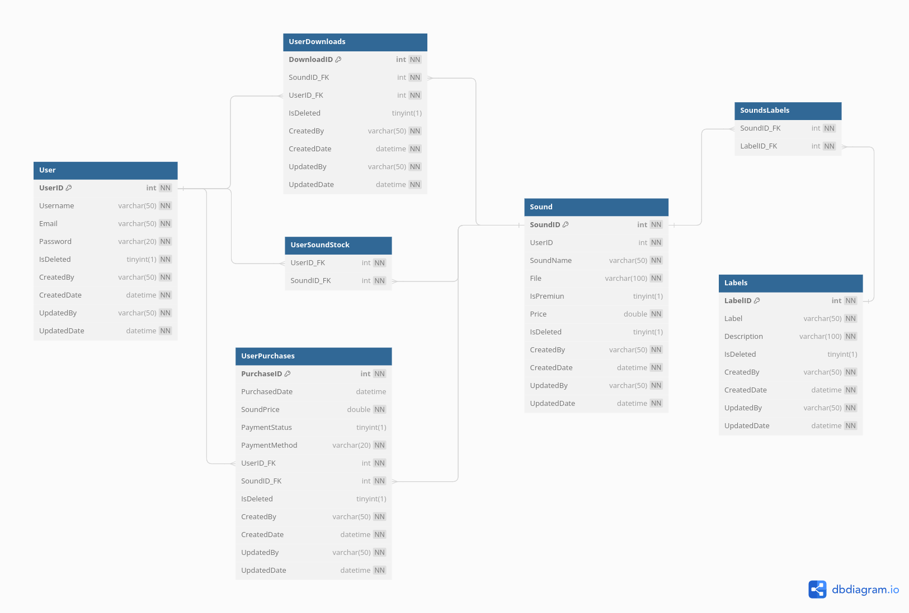

<!---
  <p align="center">
    
  </p>
-->

<style>
  body {
    max-width: 800px;
    margin: 0 auto;
    line-height: 1.5;
  }

  @page {
    size: A4;
    margin: 1cm;
  }

  .no-break {
    page-break-inside: avoid;
  }

  img {
    margin: 10px;
  }
</style>

<center>

#### INSTITUTO TECNOLÓGICO SUPERIOR DE PURÍSIMA DEL RINCÓN
<br>
<br>

<div style="text-align: center;">
  
</div>


##### INGENIERÍA INFORMÁTICA

8VO SEMESTRE
<br>
TECNOLOGÍAS WEB MULTIPLATAFORMA

PROYECTO 2DO PARCIAL DOTNET - TUNESTOCK.
<br>
##### PRESENTA:
TRISTAN FERNANDO SEGURA BARRAGÁN - RS20110001
<br>
<br>
<p style="text-align: right;">SAN FRANCISCO DEL RINCÓN, GTO. 15 DE ABRIL 2024</p>


</center>

<div style="page-break-after: always;"></div>


## Planteamiento de la idea - TuneStuck.

El proyecto pretende ser una plataforma que funja como una **bibliotecta de fragmentos de sonido para producción musical**, de manera que el contenido sea creado por los usuarios y estos mismos puedan decidir si su contenido es gratuito o conlleva un precio descargarlo.

Esto es parte de un modelo de negocio llamado **Modelo de Negocio de Plataforma de Participación**, en el que los usuarios son libres de cargar contenido a la plataforma y decidir si su consumo tiene un precio.

## Plan del proyecto.

### I.- Diseño de la base de datos.

Primeramente, es necesario establecer las funcionalidades de la plataforma y de esta manera determinar el diseño de la base de datos y las clases involucradas en el proyecto.

A continuación se especifican las entidades necesarias:


| Users           | Sounds            | Purchases           | Downloads         | Labels            |
|-----------------|-------------------|---------------------|-------------------|-------------------|
| UserID Username Email Password IsDeleted CreatedBy CreatedDate UpdatedBy UpdatedDate | SoundID UserID    SoundName File      UploadDate IsPremium Price     IsDeleted CreatedBy UpdatedBy UpdatedBy | PurchaseID PurchaseDate SoundPrice   PaymentStatus PaymentMethod UserID       SoundID      CreatedBy    CreatedDate  UpdatedBy    UpdatedDate  | DownloadID  SoundID     UserID      DownloadDate IsDeleted   CreatedBy   CreatedDate UpdatedBy   UpdatedDate | LabelID     Label       Description IsDeleted   CreatedBy   CreatedDate UpdatedBy   UpdatedDate |

Por ende, el diagrama de base de datos queda de la siguiente forma:

<p align="center">
    
</p>

#### User.

La tabla *User* se encargará de almacenar toda la información pertinente de un usuario, enlazando la lógica de descargas, sonidos disponibles o comprados, las compras realizadas por el usuario y los sonidos cargados por el usuario en la plataforma.
<br>

#### UserDownloads.

La tabla *UserDownloads* se encargará de almacenar la información sobre cada descarga individual que ha realizado el usuario, es decir, cada sonido que ha descargado el usuario.
<br>

#### UserPurchases.

La tabla *UserPurchases* se encargará de almacenar la información relevante sobre cada compra individual de un sonido que ha realizado el usuario.
<br>

#### Sound.

La tabla *Sound* será la responsable de almacenar la información de cada sonido, como sus etiquetas y la ruta hacia su archivo mp3.
<br>

#### Labels

La tabla *Labels* tendrá la responsabilidad de almacenar la información sobre cada etiqueta asignable a un sonido.
<br>

#### Consideraciones de Lógica

Ahora bien, es importante mencionar que es necesario implementar el uso de **Procedimientos almacenados** o **Triggers**, para de esta forma manejar "tras bambalinas" la información, evitándonos así tener que desarrollar muchas operaciones para la actualización de la información desde el proyecto de **.NET**.
<br>

##### 1.- Compra de un sonido.

Cuando se compre un sonido, será necesario que se haga un *insert* a la tabla de *UserSoundStock*, agregando un sonido al usuario seleccionado. De esta forma podrá ver los sonidos que ha comprado y puede descargar.
<br>

##### 2.- Lógica de eliminación.

Cuando un registro de las siguientes tablas:

- Sound.
- Labels.
- UserDownloads.
- UserPurchases.
- User.

Solamente se asignará un valor **TRUE** a la propiedad de **IsDeleted**, de esta forma manejando solo un *borrado lógico*, que nos permitirá maniobrar con los datos sin tener que efectuar un *borrado físico*, evitando así perdida de datos e incoherencias. En resumen, cuando se elimine un registro solo no será visible por el usuario debido a  la propiedad IsDeleted.

Ahora bien, el usuario podrá restaurar sus datos si así lo desea en algún momento (IsDeleted = FALSE) dependiendo de lo que se pretenda realizar.

##### 3.- Inserción de sonidos y etiquetas.

Debido a la estructura de la base de datos, es necesario establecer un **procedimiento almacenado** que permita insertar un sonido en la tabla Sound y al mismo tiempo, insertar el id de dicho registro y un id de Labels en la tabla SoundsLabels.

### II.- Creación de proyectos y paquetes correspondientes.

Después de haber concluido el diseño de la base de datos, es momento de continuar con la creación de proyectos y paquetes necesarios para desarrollar el proyecto utilizando una arquitectura de capas y el patrón de Modelo-Vista-Controlador (MVC).

El proyecto debe cumplir con la siguiente estructura:

- TuneStock
  - tunestock.database → será la carpeta para almacenar la documentación relacionada con la base de datos.
  - tunestock.docs → será la carpeta para almacenar la documentación del proyecto.
  - tunestock.api → será el proyecto encargado de manejar todas las operaciones backend y ofrecer conexión a la base de datos.
  - tunestock.core → será el proyecto responsable de almacenar el núcleo del programa (aplicación).
  - tunestock.tests → será el proyecto de pruebas unitarias.
  - tunestock.sln → será la solución del proyecto.

Las cuales se crearán de la siguiente manera:

```bash
TuneStock$ dotnet new sln
TuneStock/tunestock.api$ dotnet new webapi
TuneStock/tunestock.core$ dotnet new classlib
TuneStock/tunestock.tests$ dotnet new xunit
```
<br>

Ahora debemos referenciarlos de la siguiente forma:

```bash
TuneStock$ dotnet add tunestock.core/tunestock.core.csproj 
  reference tunestock.api/tunestock.api.csproj 

TuneStock$ dotnet add tunestock.tests/tunestock.tests.csproj 
  reference tunestock.core/tunestock.core.csproj 

TuneStock$ dotnet sln add 
  tunestock.api/tunestock.api.csproj 
  tunestock.core/tunestock.core.csproj 
  tunestock.tests/tunestock.tests.csproj
```
<br>

Después de haber efectuado estos comandos, la referencia entre proyectos debería quedar de la siguiente forma:

- tunestock.api hace uso de tunestock.core.
- tunestock.tests hace uso de tunestock.core.
- TuneStock.sln hace uso de tunestock.api, tunestock.core y tunestock.tests.

Ahora simplemente podemos realizar el siguiente comando para compilar la solución y observar que todo ha sido construido correctamente

```bash
TuneStock$ dotnet build
```
<br>

### III.- Desarrollo del proyecto Core.


